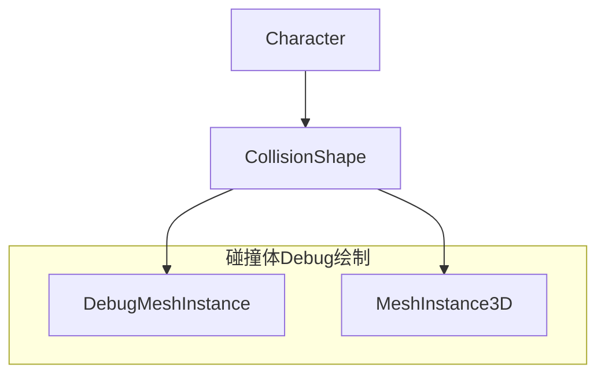
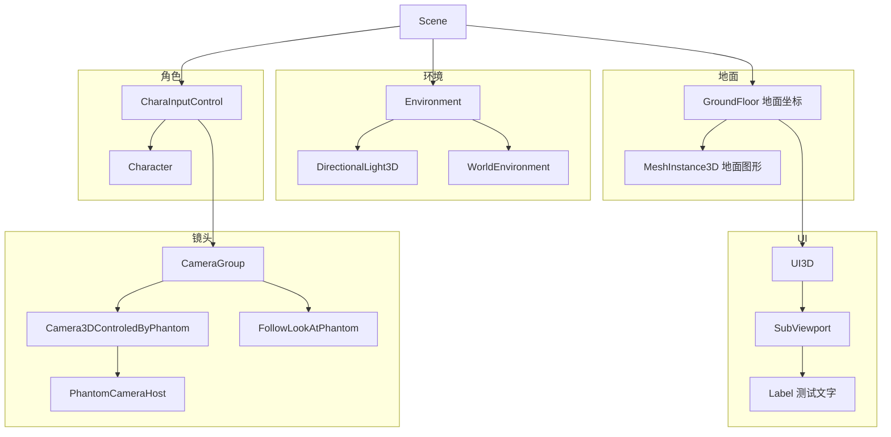

## 统一环境

使用的 Godot 版本为 [Download Godot 4.3 (stable) – Godot Engine](https://godotengine.org/download/archive/4.3-stable/) ，且统一使用 .NET 版本进行 C# 开发。
此版本对应代码仓为 [Release 4.3-stable · godotengine/godot (github.com)](https://github.com/godotengine/godot/releases/tag/4.3-stable) 。

## 实现功能
[x] 角色平移（相对于镜头方向）
[x] 镜头跟随、转动
[ ] 地面物理效果及重力效果

## 整体内容

### 角色 Character
含 `character.tscn` 和 `Character.cs` ，含角色的碰撞体与运动逻辑。

其中场景树结构为：

而 Character 含属性：
- `Speed` 移动速度

含方法：
- `MoveDirection(uiLRUD, cameraRotationOnY)` 
    - 默认 Y 轴为上方向，Z 轴为前方向，X 轴为右方向
    - `uiLRUD` 为用户输入的上下左右移动方向
    - `cameraRotationOnY` 为镜头在 Y 轴上的旋转角度
        - 要求镜头与角色在同一坐标系下
    - 方法会根据输入，确定在 XZ 平面上的移动方向
        - 目前仅会更新 `Velocity` 。

含逻辑帧处理为：
- 调用预设的 `MoveAndSlide` 方法，根据 `Velocity` 进行移动

未含物理帧处理。

### 主场景 Scene
含 `scene.tscn` 和 `CharaInputControl.cs` 。

其中场景树结构为：

#### 输入控制 CharaInputControl
含属性：
- `cameraRotationSpeed` 镜头旋转速度

含物理帧处理：
- 根据用户输入，调用角色的 `MoveDirection` 方法，更新角色的移动方向
- 根据用户输入，调用 `RotateCamera` 方法，更新镜头的旋转方向

## 现有问题

### 1. 角色平移时的抖动
角色出现重影

不是这个抖动
https://docs.godotengine.org/zh-cn/4.x/tutorials/rendering/jitter_stutter.html

而是幻影相机的问题
https://phantom-camera.dev/support/faq#i-m-seeing-jitter-what-can-i-do

我自己尝试的一种解决方案是在 Process 而非 PhysicsProcess 中更新角色的位置，这样角色的位置更新会更加平滑。但是这样做会导致角色的位置更新频率和物理引擎的更新频率不一致，可能会导致一些问题。
